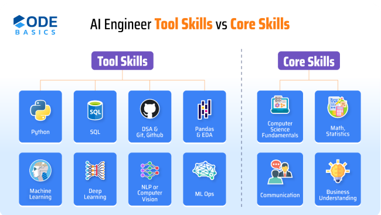

# **AI & Data Science Roadmap**

## **1. Python Programming Language**

### **Why it's Important**

Programming is essential for handling, manipulating, and analyzing data efficiently.

### **Key Languages:**

- **Python:**
  - Widely used for data science due to simplicity and extensive libraries (e.g., Pandas, NumPy, Matplotlib).
- **SQL:**
  - For querying databases and managing structured data.

---

## **2. Mathematics and Statistics (Foundation)**

### **Why it's Important**

Mathematics is the backbone of data science, helping in building models and making data-driven decisions.

### **Key Topics:**

- **Linear Algebra:** Vectors, matrices, and operations
- **Calculus:** Derivatives, gradients (used in optimization algorithms)
- **Probability:** Basic rules, distributions (Normal, Binomial, etc.)
- **Statistics:** Mean, median, mode, standard deviation, hypothesis testing, p-values

---

## **3. Data Wrangling (Preprocessing & Cleaning Data)**

### **Why it's Important**

Real-world data is often messy, requiring preprocessing to ensure reliable analysis and models.

### **Key Concepts:**

- Handling missing data and removing duplicates
- Feature scaling (normalization, standardization)
- Encoding categorical data (One-Hot Encoding, Label Encoding)

### **Key Tools & Libraries:**

- **Pandas:** For data manipulation, handling missing values, and duplicates
- **NumPy:** For numerical operations and array handling

---

## **4. Data Visualization (Communicating Insights)**

### **Why it's Important**

Visualization simplifies complex datasets, making it easier to communicate findings to non-technical stakeholders.

### **Key Tools & Libraries:**

- **Matplotlib & Seaborn:** Create detailed plots in Python
- **Tableau:** Build interactive dashboards
- **Power BI:** Popular for business analytics and reporting

### **Common Visuals:**

- Bar charts, histograms, scatter plots, line graphs
- Heatmaps, pair plots, pie charts, box plots

---

## **5. Exploratory Data Analysis (EDA)**

### **Why it's Important**

EDA helps in identifying trends, correlations, and outliers, which guide model selection and feature engineering.

### **Key Concepts:**

- Descriptive statistics (mean, median, variance)
- Visualizing relationships between variables
- Identifying trends, correlations, and outliers

### **Key Tools & Libraries:**

- **Pandas:** Data manipulation and statistical calculations
- **Seaborn & Matplotlib:** Visualization for patterns and insights
- **Kaggle:** Practice EDA with real-world datasets through kernels

---

## **6. Machine Learning (Core of Data Science)**

### **Why it's Important**

Machine learning enables building predictive models to solve real-world problems across industries.

### **Key Topics:**

- **Supervised Learning:** Linear/Logistic Regression, Decision Trees, Random Forests, SVM, KNN
- **Unsupervised Learning:** Clustering (K-Means, DBSCAN), Dimensionality reduction (PCA)
- **Model Evaluation:** Accuracy, precision, recall, F1 score, ROC-AUC
- **Reinforcement Learning:** Agents interacting with environments to maximize rewards

### **Key Libraries:**

- **Scikit-learn:** Standard library for machine learning in Python
- **TensorFlow & PyTorch:** Advanced libraries for deep learning

---

## **7. Deep Learning:**

### **Why it's Important**

Deep learning powers complex AI applications, such as image recognition, NLP, and time-series forecasting.

### **Key Topics:**

1. **Introduction to Deep Learning & Neural Networks with Keras**
   - Learn activation functions, backpropagation, and optimizers.
2. **Building Deep Learning Models with TensorFlow**
   - Hands-on with **TensorFlow** to design and train custom models.
3. **Introduction to Neural Networks with PyTorch**
   - Study flexible neural network design using **PyTorch**.
4. **Deep Learning with PyTorch**
   - Advanced usage for **image classification and NLP models**.
5. **AI Capstone Project with Deep Learning**
   - Apply deep learning techniques to create a complete project.

---

## **8. Generative AI:**

### **Why it's Important**

Generative AI enables the creation of large language models (LLMs), powering chatbots, content generation, and personalized solutions.

### **Key Topics:**

1. **Generative AI and LLMs: Architecture & Data Preparation**
   - Understand GPT and BERT architecture, with data preprocessing.
2. **Gen AI Foundational Models for NLP & Language Understanding**
   - Build NLP models for tasks like sentiment analysis and text classification.
3. **Generative AI Language Modeling with Transformers**
   - Explore **Transformer models** (e.g., GPT, T5) for text generation.
4. **Fine-Tuning Transformers for Generative AI**
   - Adapt pre-trained models for specific applications.
5. **Advanced Fine-Tuning for LLMs**
   - Optimize **LLMs** for specialized domains.

---

## **9. AI Agents:**

### **Why it's Important**

AI agents use **LLMs, LangChain, and RAG** to build task-specific virtual assistants and chatbots.

### **Key Topics:**

1. **Fundamentals of AI Agents Using RAG and LangChain**
   - Introduction to **LangChain** for creating conversational AI agents.
2. **Generative AI Projects with RAG and LangChain**
   - Combine **RAG** and **LangChain** to build interactive applications.

---

## **10. Big Data (Handling Large Data Sets)**

### **Why it's Important**

Traditional tools may struggle with large datasets, so big data tools are essential for handling and processing massive data efficiently.

### **Key Tools & Libraries:**

- **Apache Hadoop:** Distributed storage and processing framework
- **Apache Spark:** Fast, large-scale analytics engine
- **SQL & NoSQL Databases:** For structured and unstructured data management

---

## **11. Model Deployment (Bringing Models to Life)**

### **Why it's Important**

Deploying models allows them to be used in real-world scenarios and production environments.

### **Deployment Tools:**

- **Flask/Django:** Web frameworks for serving models
- **Docker:** Containerization for easy deployment across platforms

---

## **AI & Data Science Resources**

  
  

### What is Data Science:

### Intro to Deep Learning & Neural Networks:

---
