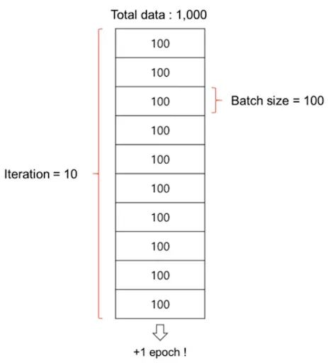

# Some important Terminologies which we use for training NN:

## Parameter:

- In Neural Networks, "parameters" refer to the elements that the model learns and adjusts during training to improve its performance.
- Parameters are the elements within a neural network that are learned from data during the training process. They primarily consist of **weights** and **biases**, which together determine the model’s ability to make predictions.

### **Weights:**

- **Definition**: Weights are the connections between neurons in different layers of the neural network.
- **Role**: Each input is multiplied by a corresponding weight, and this weighted sum is passed through the layers of the network. The values of the weights are learned during training to allow the model to map inputs to the correct outputs.

### Bias:

- **Definition**: Biases are additional parameters that are added to the weighted sum before applying the activation function.
- **Role**: Bias allows the model to shift the activation function, which is important for increasing the model's flexibility. Bias helps the network fit data more effectively by allowing it to capture patterns that cannot be captured by weights alone.

---

## Hyper Parameter:

- Hyperparameters are the settings and configurations that we set before or during training to help the model train effectively.
- Hyperparameters are the settings in a neural network model that are **not learned from the data** during training but are set **before** training begins. They control how the model is trained and can significantly affect the model's performance.

---

## Batch Size:

### What is Batch?

When training a model with a large dataset, like 100,000 or 200,000 images of cats and dogs, we cannot give all the data to the model at once. Instead, we divide the data into smaller chunks, called **batches**, and feed them to the model one by one.

### What is Batch Size?

The **batch size** refers to how many data samples are included in each batch. For example, if we have a structured dataset with 1,000 rows of data, and we divide it into 10 batches, each batch would contain 100 rows of data. In this case, the batch size would be 100.

### Why use Batch Size:

When training a model, choosing the right batch size depends on a few factors:

1. **Hardware Capabilities:** Batch size is a hyperparameter, and there is no strict rule for what size to use. It depends on the hardware (e.g., CPU or GPU) you're using. If you have strong hardware with a lot of memory, you can use a larger batch size. If the machine has limited resources, you might need to use smaller batches, which will take more time.
2. **Model Complexity:** If your model has a lot of parameters, like one with 7 billion parameters, your machine needs to store both the model’s parameters and the data. The batch size must be chosen based on the available memory. If your model's parameters take up a lot of memory, you may need to use a smaller batch size to avoid overloading the system.
